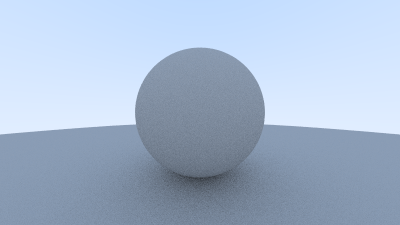

# Ray Tracer in C++

A CPU-based ray tracer built in C++ following the [_Ray Tracing in One Weekend_](https://raytracing.github.io/books/RayTracingInOneWeekend.html) book series by **Peter Shirley, Trevor David Black, and Steve Hollasch**.

---

## Credits

This project is based on and heavily inspired by:

> **"Ray Tracing in One Weekend"**  
> Peter Shirley, Trevor David Black, Steve Hollasch  
> [https://raytracing.github.io](https://raytracing.github.io)  
> Available free online under the CC0 license.

Core concepts, algorithms, and code structure are derived from the book. This implementation is for learning purposes.

---

## Features

- PPM image output
- Antialiasing via multi-sample per pixel
- Diffuse (Lambertian) shading with gamma correction
- Recursive ray bouncing with configurable max depth
- Sphere geometry and hittable object abstraction
- Random unit vector sampling for realistic light diffusion

---

## Project Structure

```
.
├── main.cpp          # Entry point, scene setup
├── camera.h          # Camera, ray generation, rendering loop
├── ray.h             # Ray class
├── vec3.h            # 3D vector math, random sampling utilities
├── color.h           # Color output with gamma correction
├── hittable.h        # Abstract hittable interface and hit record
├── hittable_list.h   # List of hittable objects (scene container)
├── sphere.h          # Sphere geometry
├── material.h        # Material base class and Lambertian material
├── interval.h        # Interval utility class
└── rtweekend.h       # Common includes, constants, and utilities
```

---

## Building

Requires a C++17 compatible compiler (e.g., `g++` or `clang++`).

```bash
g++ -O2 -std=c++17 main.cpp -o raytracer
```

---

## Running

```bash
./raytracer > output.ppm
```

Open `output.ppm` with any PPM-compatible image viewer (e.g., GIMP, IrfanView, or Preview on macOS).

---

## Configuration

Camera parameters can be adjusted in `main.cpp`:

| Parameter           | Default | Description                          |
|---------------------|---------|--------------------------------------|
| `aspect_ratio`      | 16:9    | Width-to-height ratio                |
| `image_width`       | 400     | Output image width in pixels         |
| `samples_per_pixel` | 100     | Antialiasing samples per pixel       |
| `max_depth`         | 50      | Maximum ray bounce recursion depth   |

---

## License

This project is for educational purposes. The original book content is provided free at [raytracing.github.io](https://raytracing.github.io) under the CC0 1.0 Universal license.


## Ray Traced Sphere


